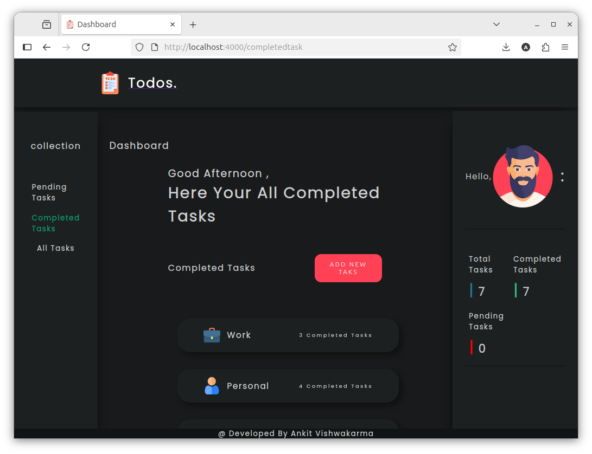
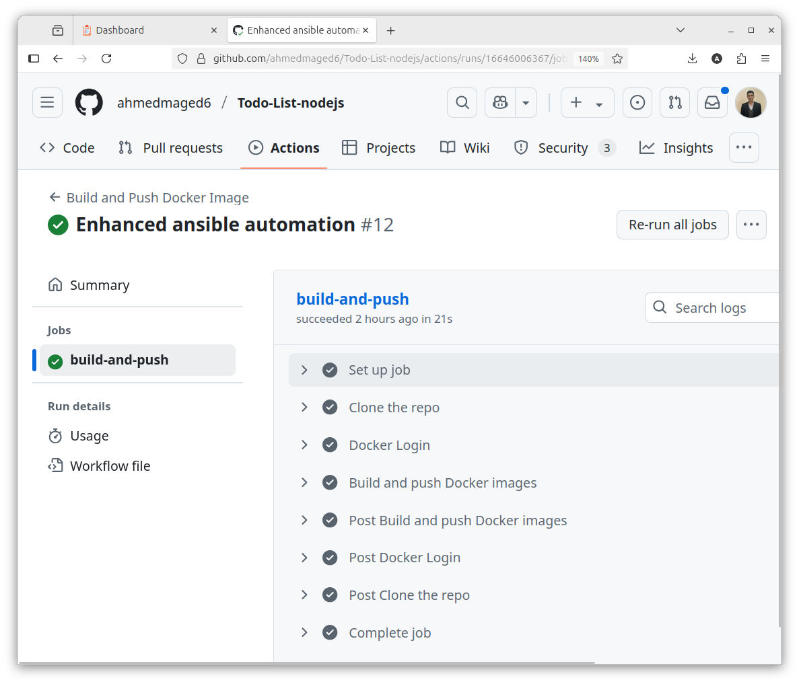
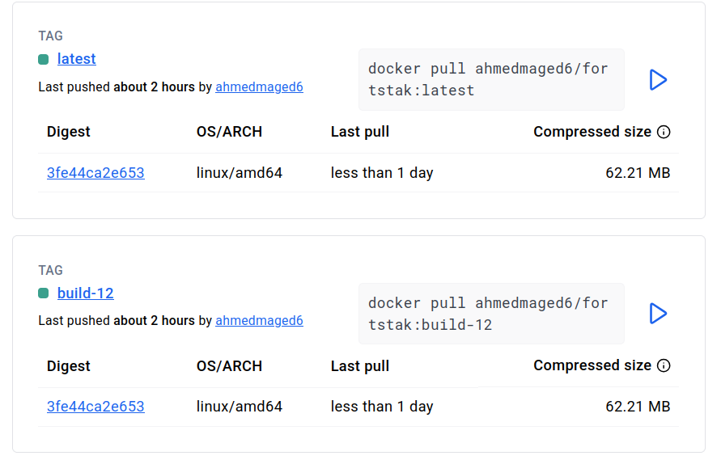
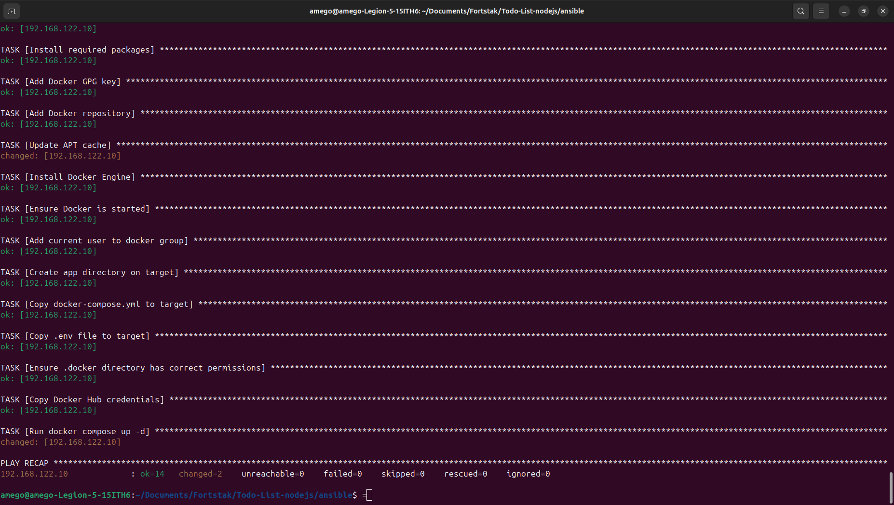
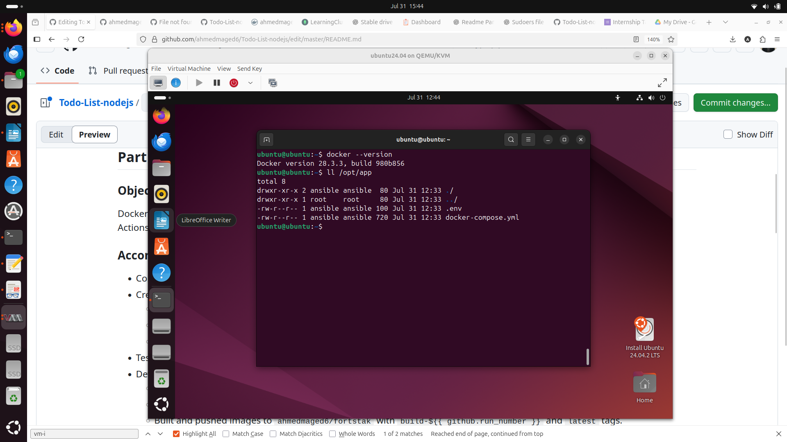
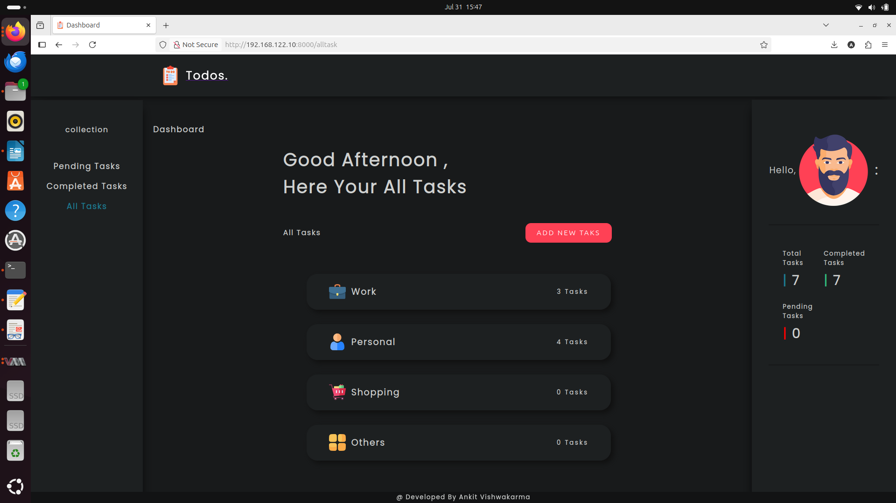
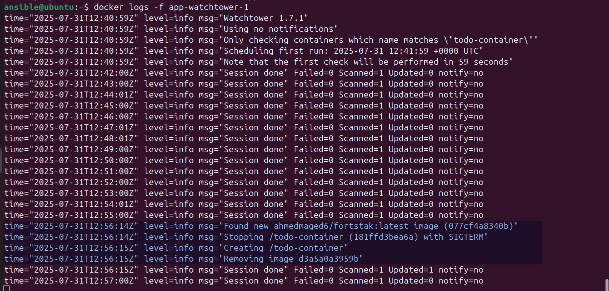

# Todo List Node.js Application - Internship Assessment

## Project Overview
This project showcases an automated deployment of a Todo List Node.js application, involving dockerization, a GitHub Actions CI pipeline, Linux VM configuration with Ansible, and Docker Compose deployment with auto-updates using watchtower.

## Part 1: Dockerization and CI Pipeline

### Objective
Dockerize the Todo List Node.js application and automate image building and pushing to a private Docker registry using GitHub Actions.

### Accomplishments
- Configured the application with a personal MongoDB database via a `.env` file.
- Created a [Dockerfile](https://github.com/ahmedmaged6/Todo-List-nodejs/blob/master/Dockerfile):
  - Used `node:lts-alpine3.22` for a lightweight container.
  - Optimized dependency installation with `package*.json` caching.
  - Exposed port 4000 and set `npm start` as the entrypoint.
- Tested the Docker image locally at `http://localhost:4000`.
- Developed a [GitHub Actions workflow](https://github.com/ahmedmaged6/Todo-List-nodejs/blob/master/.github/workflows/docker-image.yml) (`docker-image.yml`):
  - Triggered on `master` branch pushes and pull requests.
  - Authenticated with Docker Hub using secrets.
  - Built and pushed images to `ahmedmaged6/fortstak` with `build-${{ github.run_number }}` and `latest` tags.
- Verified successful CI pipeline runs in GitHub Actions.

### Screenshots
- **Local Application**:  
    
  *Description*: Application running in a Docker container on `http://localhost:4000`.
- **CI Pipeline**:  
    
  *Description*: Successful GitHub Actions workflow run for image build and push.
- **Docker Registry**:  
    
  *Description*: Docker Hub repository `ahmedmaged6/fortstak` showing pushed images with `build-<number>` and `latest` tags.

## Part 2: Linux VM Configuration with Ansible

### Objective
Set up a Linux VM using KVM and configure it with Ansible to install Docker.

### Accomplishments
- Created an Ubuntu VM using KVM with SSH access at IP `<vm-ip>`.
- Prepared the VM for Ansible:
  - Enabled SSH service and set up passwordless SSH with a key for the `ansible` user.
  - Configured passwordless sudo for the `ansible` user.
  - Installed Python3 for Ansible compatibility.
- Defined the VM in an Ansible [inventory file](https://github.com/ahmedmaged6/Todo-List-nodejs/blob/master/ansible/inventory.ini) (`inventory.ini`) for remote management.
- Developed an Ansible [playbook](https://github.com/ahmedmaged6/Todo-List-nodejs/blob/master/ansible/playbook.yml) (`playbook.yml`):
  - Installed Docker and prerequisites (e.g., `docker-ce`, `containerd.io`).
  - Added the `ansible` user to the Docker group.
  - Created `/opt/app` and copied `docker-compose.yml` and `.env` files.
  - Configured Docker Hub credentials and ran `docker compose up -d`.
- Verified Docker installation and application deployment on the VM.

### Screenshots
- **Ansible Playbook Execution**:  
    
  *Description*: Successful Ansible playbook execution from the local machine.
- **Docker on VM**:  
    
  *Description*: Docker installation verified on the VM.

## Part 3: Docker Compose Deployment and Auto-Update

### Objective
Deploy the application on the VM using Docker Compose with health checks and implement an auto-update mechanism for the Docker image.

### Accomplishments
- Developed a [Docker Compose file](https://github.com/ahmedmaged6/Todo-List-nodejs/blob/master/docker-compose.yml) (`docker-compose.yml`):
  - Configured the `todo-app` service using `ahmedmaged6/fortstak:latest`, mapping port `8000:4000`.
  - Loaded MongoDB credentials from `.env` and set a restart policy of `always`.
  - Implemented a health check using `wget --spider` to verify application availability at `http://localhost:4000`.
  - Added a `watchtower` service to monitor and update the `todo-container` every 60 seconds.
- Deployed the application on the VM, accessible at `http://<vm-ip>:8000`.
- Used Watchtower for auto-updates, justified for its lightweight design and ability to poll Docker Hub for new images.
- Verified application deployment and Watchtower updates via container logs.

### Screenshots
- **Application on VM**:  
    
  *Description*: Todo List application running on the VM at `http://<vm-ip>:8000`.
- **Watchtower Logs**:  
    
  *Description*: Watchtower logs confirming image update checks.

